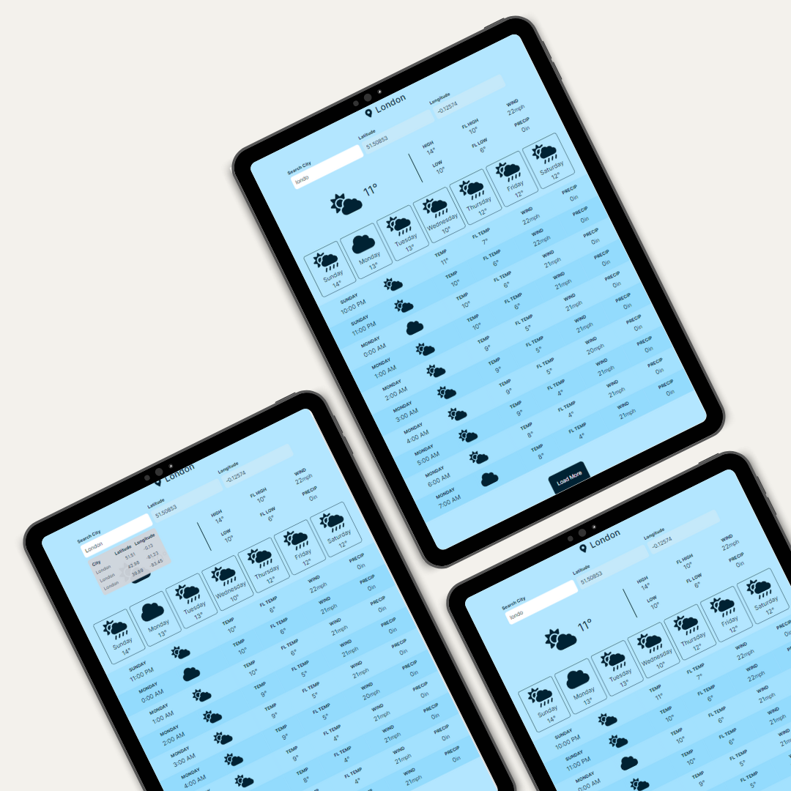
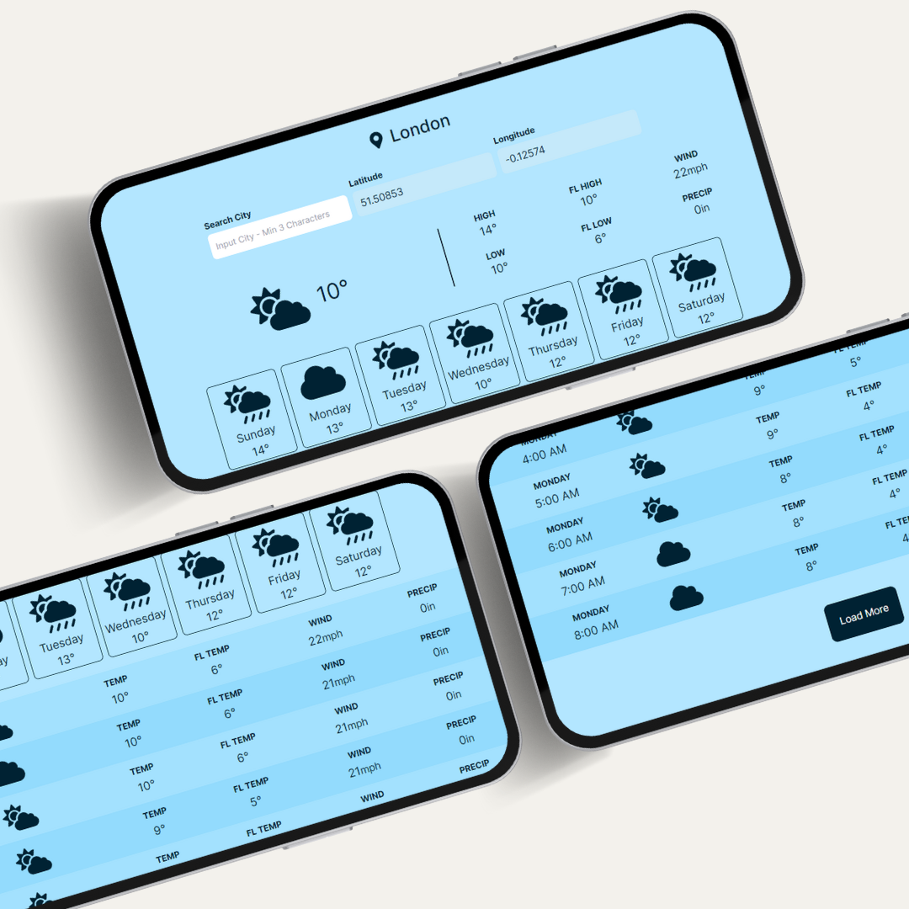

## Description

In this Next.js project, a weather app is developed with Tailwind CSS and Open-Meteo APIs for weather and search related data. It includes current, daily, and hourly weather data (temperature, high/low, feels-like, wind, precip) sourced from the open-meteo API. The app detects the user's city automatically through browser geolocation and allows manual city search.

## Demo

<p float="left" align="center">
  
  
</p>

## Getting Started

First, run the development server:

```bash
npm run dev
# or
yarn dev
# or
pnpm dev
# or
bun dev
```

Open [http://localhost:3000](http://localhost:3000) with your browser to see the result.

# Contributing
Contributions are welcome! If you have any ideas, suggestions, or bug reports, please create an issue or submit a pull request.

# License
This project is licensed under the MIT License.

## Acknowledgments
This Next.js Todo application was crafted by drawing inspiration from a variety of online resources and tutorials. Its creation has been driven by a thirst for learning, a desire to grasp new concepts and a determination to engage in research and development.
